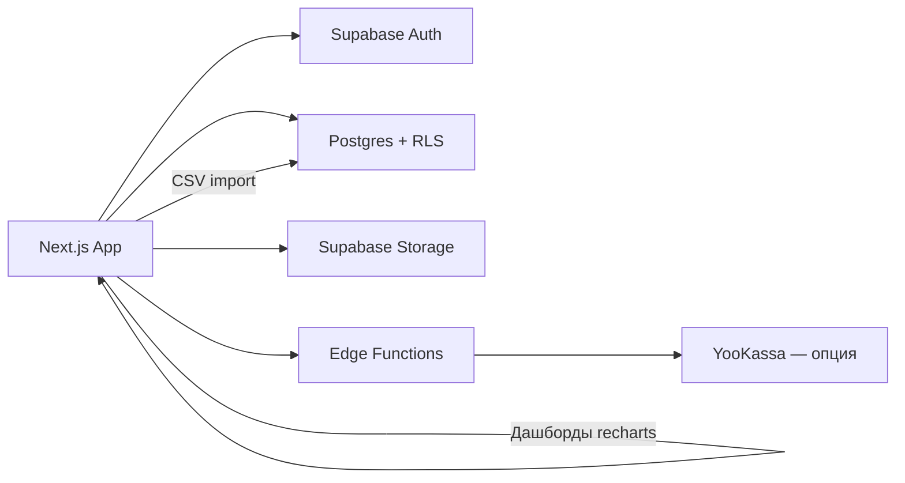
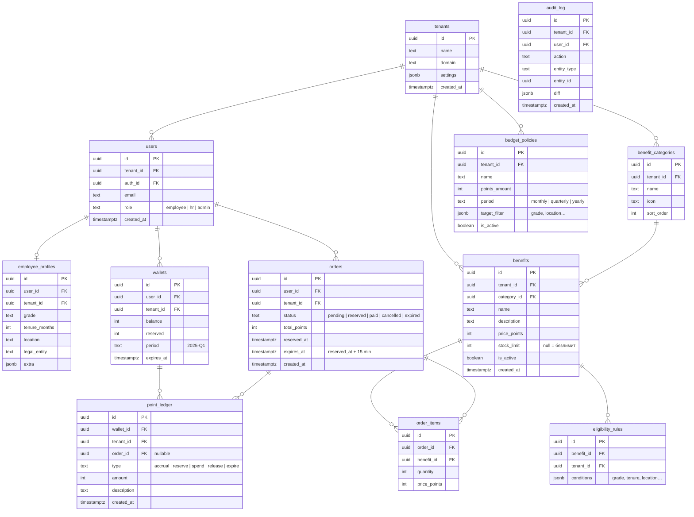
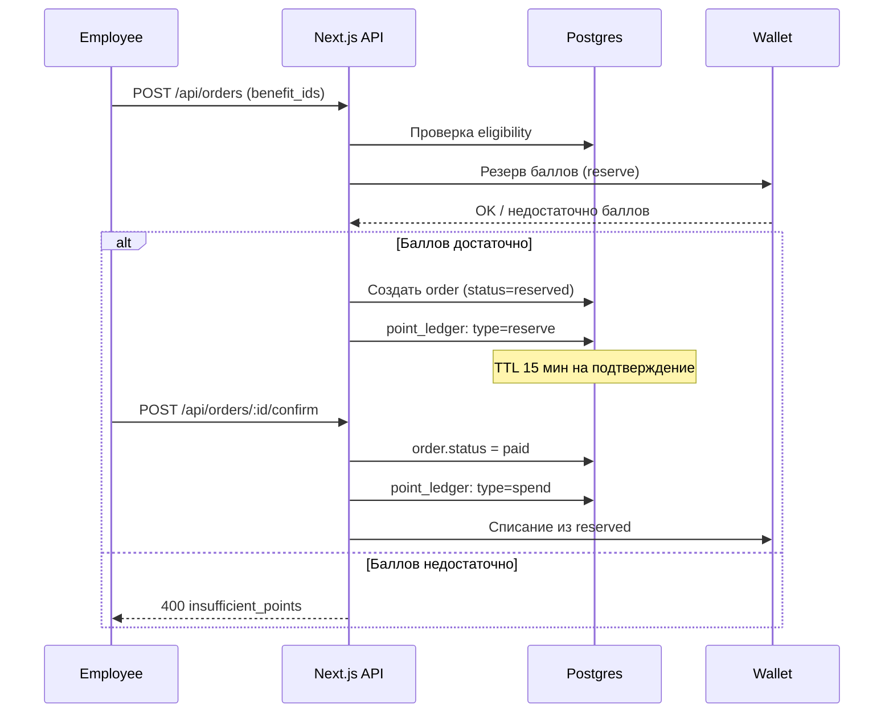

# Benefit Market (MVP)

Маркетплейс корпоративных льгот — дипломный проект магистратуры. B2B2C-платформа, где компании (tenant'ы) предоставляют сотрудникам гибкий выбор льгот в рамках выделенного бюджета баллов.

**Аналог:** [BENEFACTORY Cafeteria Benefits](https://benefactory.ru/cafeteria-benefits/)

**Scope:** MVP для одной компании-пилота, 1 fullstack-разработчик, ~10 недель.

---

## Глоссарий

| Термин | Описание |
|---|---|
| **Tenant** | Компания-клиент, арендатор платформы. Все данные изолированы по `tenant_id` |
| **Wallet** | Кошелёк сотрудника — баланс баллов на текущий период |
| **Ledger** | Неизменяемый журнал транзакций баллов (начисления, списания, возвраты) |
| **Benefit** | Льгота — товар или услуга в каталоге (ДМС, фитнес, обучение и т.д.) |
| **Eligibility rule** | Правило доступности льготы (по грейду, стажу, локации, юрлицу) |
| **Budget policy** | Политика начисления баллов — сколько баллов получает группа сотрудников |
| **Order** | Заказ — факт выбора льгот сотрудником, списание баллов |
| **Accrual** | Начисление баллов на кошелёк по политике |
| **Reserve** | Временная блокировка баллов при оформлении заказа (TTL 15 мин) |
| **RLS** | Row-Level Security — механизм Postgres для изоляции данных |

---

## Функции MVP

### Кабинет сотрудника (Employee)

- Просмотр баланса баллов и истории транзакций.
- Каталог доступных льгот с фильтрацией по eligibility rules.
- Корзина и оформление заказа (оплата баллами).
- История заказов и их статусы.

### Кабинет HR

- Импорт сотрудников из CSV (загрузка файла через UI).
- Назначение бюджетных политик группам сотрудников.
- Дашборд: утилизация бюджета, популярные категории, активность.
- Просмотр списка сотрудников и их балансов.

### Кабинет администратора (Admin)

- Управление tenant'ами (создание, настройка).
- Управление каталогом льгот (добавление, цена в баллах, лимиты, видимость).
- Управление ролями и доступами пользователей.
- Настройка eligibility rules и budget policies.
- Аудит-лог действий.

---

## Архитектура



Ключевые решения:
- **Без n8n** — импорт CSV реализуем через Next.js API route. Для дипломного MVP отдельный интеграционный движок — over-engineering.
- **Без Metabase** — дашборды на [recharts](https://recharts.org/) прямо в HR-кабинете. Данных мало, отдельный BI не нужен.
- **YooKassa как опция** — в первой итерации MVP работаем только на баллах, доплата картой — возможное расширение.

---

## Технологический стек

| Технология | Зачем |
|---|---|
| **Next.js 14 (App Router)** | SSR, API routes, middleware — всё в одном. Единый деплой |
| **TypeScript** | Типизация снижает количество багов, автокомплит ускоряет разработку |
| **shadcn/ui + Tailwind** | Готовые компоненты, быстрая стилизация без кастомного дизайна |
| **Supabase** | Auth + Postgres + Storage + Edge Functions из коробки. Бесплатный план для MVP |
| **Postgres RLS** | Изоляция данных на уровне БД — безопаснее, чем фильтрация в коде |
| **recharts** | Простые графики для HR-дашборда, лёгкая интеграция с React |
| **Zod** | Валидация входных данных на API routes и формах |
| **React Hook Form** | Формы без боли |

---

## Мультитенантность

Каждая компания = отдельный `tenant`.

Подход для MVP — **shared database, shared schema:**
- Единая БД, все таблицы содержат `tenant_id`.
- Доступ ограничивается RLS-политиками по `tenant_id` + роли пользователя.
- JWT от Supabase Auth содержит `tenant_id` и `role` в custom claims.

**Плюсы:** быстрый запуск, дёшево в эксплуатации, проще миграции.
**Минусы:** на масштабе сложнее изолировать нагруженных клиентов (для дипломного MVP не актуально).

---

## Схема данных

### Таблицы

| Таблица | Назначение |
|---|---|
| `tenants` | Компании-клиенты |
| `users` | Профиль пользователя (связь с Supabase Auth) + роль + tenant |
| `employee_profiles` | HR-атрибуты: грейд, стаж, локация, юрлицо |
| `benefit_categories` | Категории льгот (здоровье, обучение, спорт…) |
| `benefits` | Карточки льгот: название, описание, стоимость в баллах, лимиты |
| `eligibility_rules` | Правила доступности льготы для групп сотрудников |
| `budget_policies` | Правила начисления баллов (сколько, кому, за какой период) |
| `wallets` | Текущий баланс баллов сотрудника на период |
| `point_ledger` | Неизменяемый журнал: начисления, списания, резервы, возвраты |
| `orders` | Заказы сотрудников |
| `order_items` | Позиции заказа (льгота + количество + стоимость) |
| `audit_log` | Кто, когда и что изменил |

### ERD



---

## Ролевой доступ и RLS

### Роли

| Роль | Видит | Может |
|---|---|---|
| `employee` | Свой кошелёк, доступные льготы, свои заказы | Оформлять заказы, смотреть историю |
| `hr` | Сотрудники и аналитика своего tenant'а | Импорт, назначение политик, просмотр дашбордов |
| `admin` | Все данные всех tenant'ов | Управление каталогом, tenant'ами, ролями |

### Примеры RLS-политик

```sql
-- Сотрудник видит только свои заказы
CREATE POLICY "employee_orders_select" ON orders
  FOR SELECT
  USING (
    auth.uid() = user_id
    AND tenant_id = (auth.jwt() ->> 'tenant_id')::uuid
  );

-- HR видит всех сотрудников своего tenant'а
CREATE POLICY "hr_profiles_select" ON employee_profiles
  FOR SELECT
  USING (
    tenant_id = (auth.jwt() ->> 'tenant_id')::uuid
    AND (auth.jwt() ->> 'role') IN ('hr', 'admin')
  );

-- Все пользователи видят активные льготы своего tenant'а
CREATE POLICY "benefits_select" ON benefits
  FOR SELECT
  USING (
    tenant_id = (auth.jwt() ->> 'tenant_id')::uuid
    AND is_active = true
  );

-- Записи в ledger — только через service role (Edge Functions)
CREATE POLICY "ledger_insert" ON point_ledger
  FOR INSERT
  WITH CHECK (false);  -- никто через RLS, только service_role
```

### Middleware

```typescript
// middleware.ts — проверка роли на уровне маршрутов
const roleRoutes = {
  '/dashboard/employee': ['employee'],
  '/dashboard/hr':       ['hr', 'admin'],
  '/dashboard/admin':    ['admin'],
};
```

---

## Бизнес-процессы

### Импорт сотрудников

1. HR загружает CSV через UI.
2. Next.js API route (`POST /api/import/employees`) парсит файл, валидирует строки через Zod.
3. Upsert в `employee_profiles` по email.
4. Если у нового сотрудника нет кошелька — создаётся автоматически.
5. Ответ: количество созданных / обновлённых / ошибок + список ошибок.

### Начисление баллов (Accrual)

1. Вызов `POST /api/wallets/accrual` (вручную HR или по cron через Edge Function).
2. Для каждого сотрудника tenant'а находим подходящую `budget_policy` по `target_filter`.
3. Создаём запись в `point_ledger` с типом `accrual`.
4. Обновляем `wallets.balance` (через транзакцию).
5. Если кошелёк с `period` не существует — создаём.

### Покупка льготы



### Сгорание резерва (TTL)

- При создании заказа `orders.expires_at = NOW() + interval '15 minutes'`.
- Edge Function по cron (каждые 5 мин) находит `status = reserved AND expires_at < NOW()`.
- Меняет статус на `expired`, создаёт запись `point_ledger: type=release`, возвращает баллы в `wallets.balance`.

### Отмена заказа

- Сотрудник может отменить заказ в статусе `reserved` (до подтверждения).
- `POST /api/orders/:id/cancel` → `status = cancelled`, `point_ledger: type=release`.
- Заказ в статусе `paid` отменить нельзя (для MVP).

### Сгорание баллов (Expiration)

- У каждого кошелька есть `expires_at` (конец периода).
- Edge Function по cron: находит кошельки с `expires_at < NOW() AND balance > 0`.
- Создаёт запись `point_ledger: type=expire`, обнуляет `wallets.balance`.

---

## API

### Аутентификация

Все запросы требуют `Authorization: Bearer <supabase_token>`. Роль и `tenant_id` извлекаются из JWT.

### Эндпоинты

| Метод | Путь | Роль | Описание |
|---|---|---|---|
| `GET` | `/api/benefits` | employee, hr, admin | Каталог доступных льгот (с учётом eligibility) |
| `GET` | `/api/benefits/:id` | employee, hr, admin | Детали льготы |
| `GET` | `/api/wallets/me` | employee | Текущий баланс и история |
| `GET` | `/api/wallets` | hr, admin | Кошельки сотрудников tenant'а |
| `POST` | `/api/orders` | employee | Создать заказ (резерв баллов) |
| `POST` | `/api/orders/:id/confirm` | employee | Подтвердить заказ (списать баллы) |
| `POST` | `/api/orders/:id/cancel` | employee | Отменить заказ (вернуть резерв) |
| `GET` | `/api/orders` | employee | Мои заказы |
| `GET` | `/api/orders/all` | hr, admin | Все заказы tenant'а |
| `POST` | `/api/import/employees` | hr | Импорт CSV |
| `POST` | `/api/wallets/accrual` | hr, admin | Запуск начисления баллов |
| `GET` | `/api/reports/dashboard` | hr | Данные для HR-дашборда |
| `GET` | `/api/admin/tenants` | admin | Список tenant'ов |
| `POST` | `/api/admin/tenants` | admin | Создать tenant |
| `CRUD` | `/api/admin/benefits` | admin | Управление каталогом |
| `CRUD` | `/api/admin/policies` | admin | Управление budget policies |
| `CRUD` | `/api/admin/rules` | admin | Управление eligibility rules |
| `GET` | `/api/admin/audit-log` | admin | Аудит-лог |

### Формат ответов

```json
// Успех
{
  "data": { ... },
  "meta": { "page": 1, "per_page": 20, "total": 150 }
}

// Ошибка
{
  "error": {
    "code": "insufficient_points",
    "message": "Недостаточно баллов. Доступно: 500, требуется: 800"
  }
}
```

---

## Безопасность

### Базовый уровень для MVP

- **Аутентификация** — Supabase Auth (email + пароль), JWT-токены.
- **Авторизация** — Postgres RLS + middleware проверки ролей.
- **Валидация входных данных** — Zod на каждом API route.
- **CSRF** — Next.js built-in protection.
- **XSS** — React escaping + CSP headers.
- **Rate limiting** — Supabase Edge Functions + middleware (базовый).
- **Аудит** — таблица `audit_log` для всех мутаций.

### 152-ФЗ (Персональные данные)

Платформа обрабатывает ПДн сотрудников (ФИО, email, грейд, локация). Требования:

- **Хранение** — БД должна размещаться на территории РФ.
- **Согласие** — при регистрации сотрудник подтверждает согласие на обработку ПДн.
- **Доступ** — данные изолированы по `tenant_id`, HR видит только своих сотрудников.
- **Удаление** — должна быть возможность удалить ПДн по запросу (soft delete + очистка по cron).
- **Логирование** — `audit_log` фиксирует доступ к ПДн.
- **Передача** — HTTPS everywhere, данные не передаются третьим лицам.

> Для дипломного MVP достаточно описать меры и реализовать базовую изоляцию. Полный compliance 152-ФЗ требует юридической экспертизы.

---

## Деплой

### Варианты хостинга (с учётом РФ)

| Вариант | Next.js | Postgres | Плюсы | Минусы |
|---|---|---|---|---|
| **Supabase Cloud + Vercel** | Vercel | Supabase (AWS eu) | Быстрый старт, бесплатный план | Сервера за рубежом (152-ФЗ) |
| **Selectel / Timeweb Cloud** | Docker / Node.js | Managed Postgres | Сервера в РФ, 152-ФЗ ок | Нужно настраивать самому |
| **Yandex Cloud** | Cloud Functions / VM | Managed PostgreSQL | РФ, managed-сервисы | Дороже для MVP |

**Рекомендация для MVP:** Supabase Cloud + Vercel для разработки и демо. Если на защите спросят про 152-ФЗ — обосновать, что production-деплой переедет на Selectel/Yandex Cloud.

### Переменные окружения

```env
NEXT_PUBLIC_SUPABASE_URL=
NEXT_PUBLIC_SUPABASE_ANON_KEY=
SUPABASE_SERVICE_ROLE_KEY=
# Опционально для будущих итераций:
# YOOKASSA_SHOP_ID=
# YOOKASSA_SECRET=
```

---

## Что НЕ делаем в MVP

- Мобильное приложение (адаптивный web достаточен).
- Доплата картой через YooKassa (только баллы в первой итерации).
- Полный электронный документооборот с провайдерами льгот.
- Многоуровневые цепочки согласования (approvals).
- Внешний кабинет поставщика льгот.
- Рекомендательная система / ML.
- SSO / SAML (достаточно email + пароль).
- Интеграция с 1С / HRIS (достаточно CSV-импорта).
- Push-уведомления и Telegram-бот.

---

## План разработки (~10 недель, 1 разработчик)

### Этап 1. Фундамент (недели 1–2)

- Инициализация Next.js + Supabase проекта.
- SQL-схема: все таблицы + RLS-политики.
- Supabase Auth: регистрация, вход, JWT с custom claims (role, tenant_id).
- Layout трёх кабинетов с route protection (middleware).
- Seed-данные: тестовый tenant, пользователи, льготы.

### Этап 2. Каталог и кошельки (недели 3–4)

- Каталог льгот: список, фильтрация, карточка.
- Eligibility rules: проверка доступности.
- Кошельки: отображение баланса, история транзакций.
- Budget policies + начисление баллов (accrual).

### Этап 3. Заказы и HR-кабинет (недели 5–6)

- Корзина и оформление заказа.
- Резерв баллов + подтверждение + отмена.
- TTL резервов (cron Edge Function).
- CSV-импорт сотрудников.
- HR-дашборд: утилизация, популярные категории, графики на recharts.

### Этап 4. Админка и полировка (недели 7–8)

- Админ-панель: управление tenant, каталогом, политиками, правилами.
- Аудит-лог.
- Сгорание баллов (expiration cron).
- UI-полировка, адаптивность, обработка ошибок.

### Этап 5. Тестирование и документация (недели 9–10)

- E2E тесты основных сценариев (Playwright).
- Нагрузочное тестирование (k6 — базовое).
- Финальное README / документация для защиты.
- Деплой демо-стенда.

---

## Критерии успеха (для защиты диплома)

### Функциональные

- [ ] Три кабинета работают: employee, hr, admin.
- [ ] Сотрудник может выбрать льготу и оплатить баллами.
- [ ] HR может импортировать сотрудников и видеть дашборд.
- [ ] Админ может управлять каталогом и tenant'ами.
- [ ] Данные изолированы между tenant'ами (RLS).

### Нефункциональные

- [ ] Время ответа API < 500ms (p95).
- [ ] Система выдерживает 100 одновременных пользователей.
- [ ] Нет критических уязвимостей (OWASP Top 10 проверка).

### Для диплома

- [ ] Рабочий демо-стенд с тестовыми данными.
- [ ] Описаны архитектурные решения и их обоснования.
- [ ] Сравнение с аналогами (BENEFACTORY, «Подарок сотруднику», др.).
- [ ] Описаны ограничения MVP и план развития.

---

## Риски

| Риск | Вероятность | Влияние | Митигация |
|---|---|---|---|
| Нехватка времени на все фичи | Высокая | Высокое | Жёсткий приоритет: каталог → заказы → импорт → дашборд |
| Сложности с RLS-политиками | Средняя | Среднее | Начать с простых политик, тестировать на seed-данных |
| Ошибки в списании баллов | Низкая | Высокое | Только через `point_ledger`, транзакции, инварианты в БД |
| 152-ФЗ вопросы на защите | Средняя | Среднее | Описать меры в документации, обосновать выбор хостинга |
